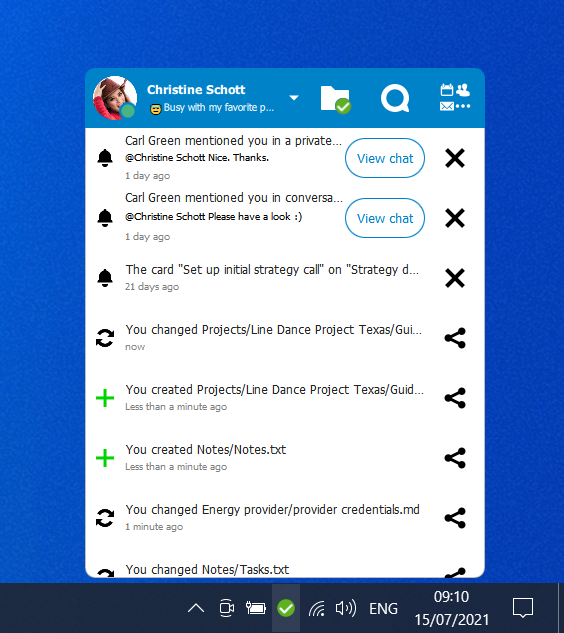

<!--
  - SPDX-FileCopyrightText: 2017 Nextcloud GmbH and Nextcloud contributors
  - SPDX-FileCopyrightText: 2011 Nextcloud GmbH and Nextcloud contributors
  - SPDX-License-Identifier: GPL-2.0-or-later
-->
# Nextcloud Desktop Client — Delta Sync Fork

> **This is a fork of [nextcloud/desktop](https://github.com/nextcloud/desktop) that adds block-level delta sync.**
>
> When the [CrispCloud Delta Sync](https://github.com/CrispStrobe/crispcloud-delta-sync) server app is installed on your Nextcloud, this client uploads only the 4 MB blocks that actually changed — instead of re-uploading entire files. A 500 MB VeraCrypt container where 8 MB changed? Only 2 blocks uploaded, **98.4% bandwidth saved**.
>
> **Branch:** `delta-sync` | **Status:** CI-verified on Linux, Windows, macOS | **[Download binaries](https://github.com/CrispStrobe/nextcloud-desktop/releases/tag/delta-sync-latest)**

## Download

Pre-built binaries are available from the [Releases page](https://github.com/CrispStrobe/nextcloud-desktop/releases/tag/delta-sync-latest):

- **Linux:** AppImage (x86_64)
- **Windows:** Installer (x86_64, MSVC 2022)
- **macOS:** DMG (ARM64)

These are built automatically from the `delta-sync` branch on every push.

## What's different from upstream

| Feature | Upstream | This fork |
|---------|----------|-----------|
| Large file upload | Full re-upload or chunked | Block-level delta (Adler-32 + SHA-256 per 4 MB block) |
| Settings toggle | N/A | General Settings > "Enable block-level delta sync for large files" |
| Activity display | "You changed file.bin" | "You changed file.bin (delta sync: 2/125 blocks, 98.4% saved)" |
| Desktop notification | N/A | Shows bandwidth savings on delta sync completion |
| Logging | N/A | Full category logging under `nextcloud.sync.propagator.upload.delta` |
| Fallback | N/A | Graceful fallback to chunked upload if server app unavailable |
| File shrink | Re-upload corrupts tail | Finalize sends `?size=N`; server truncates to exact new size |

### Requirements

- **Server:** Install the [crispcloud_delta](https://github.com/CrispStrobe/crispcloud-delta-sync) app — PHP for Nextcloud 25–33 / ownCloud 10.11+, or the [Go sidecar](https://github.com/CrispStrobe/crispcloud-delta-sync/tree/main/ocis) for oCIS v5+
- **File size:** Delta sync activates for files >= 10 MB
- **Compatibility:** Nextcloud 25–33; branch is rebased onto upstream `master`

### Files changed

- `src/libsync/propagateuploaddelta.h/.cpp` — new `PropagateUploadFileDelta` class
- `src/libsync/capabilities.h/.cpp` — `deltaSyncAvailable()` capability check
- `src/libsync/configfile.h/.cpp` — `deltaSyncEnabled()` settings toggle
- `src/libsync/owncloudpropagator.cpp` — integration into upload job creation
- `src/gui/generalsettings.ui/.cpp` — settings checkbox
- `src/gui/tray/usermodel.cpp` — activity display + notifications
- `src/libsync/syncfileitem.h` — `_deltaSyncInfo` field
- `test/testdeltasync.cpp` — 11 unit tests (Adler-32 correctness, block map construction, diff logic, JSON parsing)

---

[](https://api.reuse.software/info/github.com/nextcloud/desktop)

The Nextcloud Desktop Client is an app to synchronize files from Nextcloud Server with your computer available for Windows, macOS and Linux.

<p align="center">
    
</p>

## Downloads 🚀
For the latest stable and recommended version, please refer to [the official download page](https://nextcloud.com/install/#install-clients).

## Help 🛟
You can find [the user, administration and developer manuals for the desktop client](https://docs.nextcloud.com/#desktop) on our central documentation site.

## Contributing 🫴
:v: Please read the [Code of Conduct](https://nextcloud.com/community/code-of-conduct/). This document offers some guidance to ensure Nextcloud participants can cooperate effectively in a positive and inspiring atmosphere and to explain how together we can strengthen and support each other.

## Join the team 👪
There are many ways to contribute, of which development is only one! Find out [how to get involved](https://nextcloud.com/contribute/), including as a translator, designer, tester, helping others, and much more! 😍

## Help testing 🔬
Download and install the client:

- [All releases](https://github.com/nextcloud-releases/desktop/releases)<br>
- [Daily builds](https://download.nextcloud.com/desktop/daily)

## Reporting issues 🐛
If you find any bugs or have any suggestion for improvement, please
[open an issue in this repository](https://github.com/nextcloud/desktop/issues).

## Bug fixing and development 🛠️

> [!TIP]
> For contributors on macOS, see the [macOS development guide](./doc/macOS-development.md).

> [!NOTE]  
> Find the system requirements and instructions on [how to work on Windows with KDE Craft](https://github.com/nextcloud/desktop-client-blueprints/) on our [desktop client blueprints repository](https://github.com/nextcloud/desktop-client-blueprints/).

### System requirements
- [Windows 10, Windows 11](https://github.com/nextcloud/desktop-client-blueprints/), macOS 13 Ventura (or newer) or Linux
- [🔽 Inkscape (to generate icons)](https://inkscape.org/release/)
- Developer tools: cmake, clang/gcc/g++:
- Qt6 since 3.14, Qt5 for earlier versions
- OpenSSL
- [🔽 QtKeychain](https://github.com/frankosterfeld/qtkeychain)
- SQLite
- [Xcode](https://developer.apple.com/xcode/) (only on macOS)

Optional recommendations:

- [Qt Creator IDE](https://www.qt.io/product/development-tools)
- [delta: A viewer for git and diff output](https://github.com/dandavison/delta)

### Build

Step by step instructions on how to build the client to contribute.

1. Clone the Github repository: `git clone https://github.com/nextcloud/desktop.git`
2. Create build directory: `mkdir <build directory>`
3. Navigate into build directory: `cd <build directory>`
4. Compile: `cmake -S <cloned desktop repo> -B build -DCMAKE_PREFIX_PATH=<dependencies> -DCMAKE_BUILD_TYPE=Debug -DCMAKE_INSTALL_PREFIX=. -DNEXTCLOUD_DEV=ON`

> [!TIP]
> The cmake variable NEXTCLOUD_DEV allows you to run your own build of the client while developing in parallel with an installed version of the client.

Then you might continue with these steps:
	
1. 🐛 [Pick a good first issue](https://github.com/nextcloud/desktop/labels/good%20first%20issue)
2. 👩‍🔧 Create a branch and make your changes. Remember to sign off your commits using `git commit -sm "Your commit message"`
3. ⬆ Create a [pull request](https://opensource.guide/how-to-contribute/#opening-a-pull-request) and `@mention` the people from the issue to eview
4. 👍 Fix things that come up during a review
5. 🎉 Wait for it to get merged!

### Test servers

The easiest way to have a local Nextcloud server to develop, debug and test the client against is [the Nextcloud Docker image](https://github.com/nextcloud/docker).
The following example shows how to deploy a Nextcloud Docker container on the local host which will be removed again as soon as the command is interrupted.
Note that this requires Docker to be installed in your developer environment.

```bash
docker run \
    --rm \
    --publish 8080:80 \
    --env SQLITE_DATABASE=nextcloud.sqlite \
    --env NEXTCLOUD_ADMIN_USER=admin \
    --env NEXTCLOUD_ADMIN_PASSWORD=admin \
    nextcloud
```

This simple test server already suffices in the most cases. For more advanced server test deployments we also recommend [Nextcloud development environment on Docker Compose](https://juliusknorr.github.io/nextcloud-docker-dev/).

## Get in touch 💬
* [📋 Forum](https://help.nextcloud.com)
* [🐘 Mastodon](https://mastodon.xyz/@nextcloud)
* [🔗 LinkedIn](https://www.linkedin.com/company/nextcloud-gmbh/)
* [🦋 Bluesky](https://bsky.app/profile/nextcloud.bsky.social)
* [👥 Facebook](https://www.facebook.com/nextclouders)

You can also [get professional support for Nextcloud and the desktop client](https://nextcloud.com/support)!

## License 📜

    This program is free software; you can redistribute it and/or modify
    it under the terms of the GNU General Public License as published by
    the Free Software Foundation; either version 2 of the License, or
    (at your option) any later version.

    This program is distributed in the hope that it will be useful, but
    WITHOUT ANY WARRANTY; without even the implied warranty of MERCHANTABILITY
    or FITNESS FOR A PARTICULAR PURPOSE. See the GNU General Public License
    for more details.
